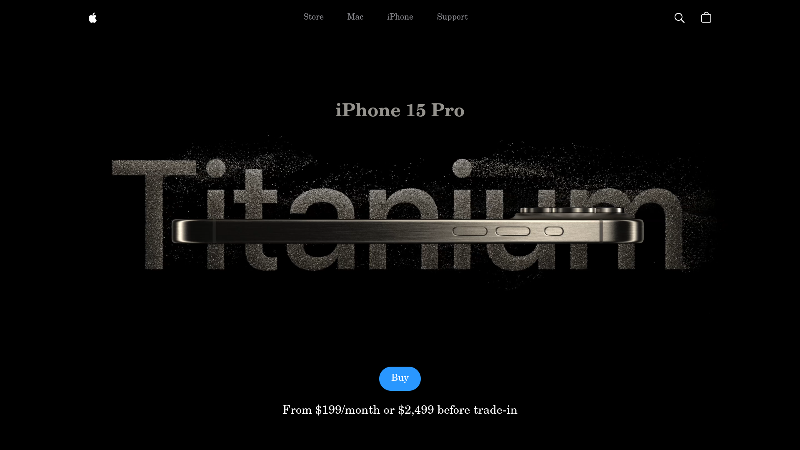

# 🍎 Apple Site Clone – In Progress

## 📸 Sneak Peek



Hey! Welcome to the repo for my Apple-inspired site – a pixel-perfect, front-end clone in the making. This project is all about replicating the elegance, smooth animations, and modern UI style you'd expect from a brand like Apple… but built entirely from scratch using clean HTML, CSS (Tailwind), and JavaScript.

---

## 🚧 Project Status: Work In Progress

This isn't the final show yet — expect updates, improvements, and plenty of polish coming soon. Animations, scroll effects, mobile responsiveness, and accessibility are all in the roadmap.

So far, we've got:
- ✅ Initial layout and structure
- ✅ Responsive navbar setup
- ✅ Hero section mockup
- 🛠️ Animations and scroll effects (in progress)
- 🧪 Cross-browser and device testing coming up next

---

## 🎯 Tech Stack

| Tool | Use |
|------|-----|
| **HTML5** | Page structure |
| **TailwindCSS** | Utility-first styling |
| **JavaScript** | Interactivity & dynamic effects |
| **Vite (optional)** | For faster dev builds and modular setup (coming soon) |

---

## 🌍 Live Preview

👉 [**Click here to view the deployed site**](https://apple-site-clone.vercel.app)  
*(Note: May reflect a WIP version depending on the last deploy)*

---

## ✨ Features (Planned & Existing)

- 🍃 Smooth scroll animations
- 🍎 Apple-style minimal UI
- 📱 Fully responsive layout
- 🌓 Light/Dark mode toggle (maybe… 👀)
- ⚙️ Optimized performance with clean code structure

---

## 📄 License

This project is open source and available under the [MIT License](LICENSE).

## 🤝 Contributing

Contributions, issues, and feature requests are welcome! Feel free to check the issues page.


```md

